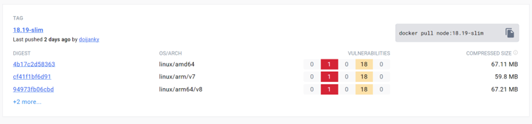
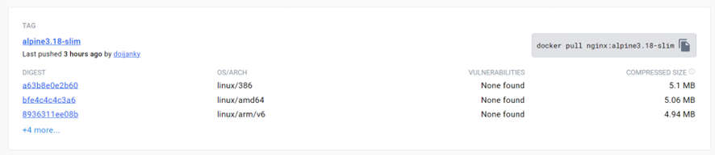

# Containerizing a secure application in docker

This example application will review and highlight some important points for deploying it in Docker, highlighting security.

## Application operation

To know how to deploy this application in containers, you must know how it works. It consists of two parts:

- *backend* , formed by a service in charge of executing a very basic API defined through **node**.

- *frontend* , which in turn is made up of two services:
 
   - The entry part to the application, which will be an **nginx** to redirect requests and the entry point to the application.
   - The logical part of the front. which communicates with the back using **node**.

So we will deploy two docker containers (one for each part of the application).

We will associate each service defined in each of the two parts with a docker image. Therefore, we must create a *multi-stage* Dockerfile for the backend and a *multi-stage* Dockerfile for the front.

#### Dockerfile backend

```dockerfile
FROM node@sha256:e9dbce470d22c34e5cc91e305f5ad3fd14b3f02e36fd8a7746e3e5a9e4de4655 AS build-env

WORKDIR /app
RUN groupadd -g 1002  nodegroup && useradd -u 1002 -g 1002 usernode && chown -R usernode /app && chmod 550 /app

COPY ./package.json /app/package.json
COPY ./package-lock.json /app/package-lock.json

RUN npm ci
RUN chmod 770 /app/node_modules
USER usernode
COPY . .

CMD ["node", "server.js"]

# Image node distroless(neither user privilegies nor shell )
FROM gcr.io/distroless/nodejs@sha256:0f7fbe2f3853fd719204ff417dda421eea2f8db8e17875820fddac5d3a8f572c
COPY --from=build-env --chown=1002:1002 /app /app
COPY --from=build-env /etc/passwd /etc/passwd
COPY --from=build-env /etc/group /etc/group

USER 1002

WORKDIR /app
CMD [ "server.js"]
```
#### Dockerfile frontend

```dockerfile
#Image node with yarn for building the front
FROM node@sha256:e9dbce470d22c34e5cc91e305f5ad3fd14b3f02e36fd8a7746e3e5a9e4de4655 AS build
ARG REACT_APP_SERVICES_HOST=/services/m

WORKDIR /app

COPY ./package.json /app/package.json
COPY ./package-lock.json /app/package-lock.json
RUN yarn install

COPY . .
RUN yarn build

#Image debian for creating the nginx configuration with no root
FROM debian@sha256:2c22645bfe97aa1ed1c930adf5970fee3454f9a42a19214051ec677cba805712 as builder

ENV USER=nonroot
ENV UID=10001 

RUN adduser \    
    --disabled-password \    
    --gecos "" \    
    --home "/nonexistent" \    
    --shell "/sbin/nologin" \    
    --no-create-home \    
    --uid "${UID}" \    
    "${USER}"

RUN apt update && apt -y install wget gnupg binutils && \
    wget "https://nginx.org/keys/nginx_signing.key" && \
    apt-key add nginx_signing.key && \
    echo "deb https://nginx.org/packages/mainline/debian/ bullseye nginx" >/etc/apt/sources.list.d/nginx.list && \
    echo "deb-src https://nginx.org/packages/mainline/debian/ bullseye nginx" >>/etc/apt/sources.list.d/nginx.list && \
    apt update && \
    apt install -y nginx && \
    apt install --download-only --reinstall nginx lsb-base  libgcc-s1 libc6 libcrypt1 libpcre2-8-0 libssl1.1 zlib1g && \
    apt install --download-only --reinstall libidn2-0 libnss-nis libnss-nisplus  debconf gcc-10-base && \
    for f in /var/cache/apt/archives/*.deb; do dpkg-deb -xv $f /packages; done && \
    rm -rf /packages/usr/share/bash-completion  \
        /packages/usr/share/debconf \
        /packages/usr/share/doc \
        /packages/usr/share/lintian	\
        /packages/usr/share/locale	\
        /packages/usr/share/man \
        /packages/usr/share/perl5  \
        /packages/usr/share/pixmaps \
        /packages/usr/bin \
        /packages/usr/bin/dpkg* \
        /packages/usr/bin/nginx-debug && \
        mkdir -p /packages/var/run

RUN chown -R nonroot:nonroot /var/cache /var/run

RUN touch /var/run/nginx.pid && \
    chown -R nonroot:nonroot /var/run/nginx.pid

# Empty image with the result of the nginx and node images and entrypoint of the app

FROM scratch
COPY --from=builder /packages /
COPY --from=builder /etc/passwd /etc/passwd
COPY --from=builder /etc/group /etc/group
COPY --from=builder /var/cache /var/cache
COPY --from=builder /var/run /var/run

COPY ./nginx/nginx.conf /etc/nginx/nginx.conf
COPY ./nginx/default.conf /etc/nginx/conf.d/default.conf
COPY --from=build /app/build /usr/share/nginx/html

RUN --mount=type=bind,from=builder,target=/mount ["/mount/bin/ln", "-sf", "/dev/stdout", "/var/log/nginx/access.log"]
RUN --mount=type=bind,from=builder,target=/mount ["/mount/bin/ln", "-sf", "/dev/stderr", "/var/log/nginx/error.log"]

EXPOSE 8000

USER nonroot

CMD ["/usr/sbin/nginx", "-g", "daemon off;"]
```

Finally a *docker compose* file to relate them and build the scenario.

#### Docker compose 

```dockerfile
version: '3.8'

services:
  frontend:
    image: jascarr/exercise-nginx-frontend:v1 
    build: 
      context: ./frontend
      args:
        - REACT_APP_SERVICES_HOST=/services/m
    deploy:
        restart_policy:
            condition: on-failure
            delay: 5s
            max_attempts: 3
            window: 120s
        resources:
            limits:
              cpus: '0.50'
              memory: 512M
            reservations:
              cpus: '0.25'
              memory: 128M        
    ports:
      - "8000:80"
    networks: 
      - frontend
      - backend
  
  backend:
    image: jascarr/exercise-node-backend:v1 
    build:
      context: ./backend
    deploy:
        restart_policy:
            condition: on-failure
            delay: 5s
            max_attempts: 3
            window: 120s    
        resources:
            limits:
              cpus: '0.50'
              memory: 512M
            reservations:
              cpus: '0.25'
              memory: 128M      
    networks: 
      - backend

networks: 
  frontend:
  backend:
```

## Good Practice Considerations

1. ***Choice of official base images***

For our case we will need an image with node and another with nginx, so we must choose them from the DockerHub image repository taking into account that they are verified:


> Additionally, Docker must be configured to only interact with images
> verified.<br> To do this, the value of the variable **DOCKER_CONTENT_TRUST** must be changed to 1.<br>
> Windows(Powershell): **$env:DOCKER_CONTENT_TRUST=1**<br>
> Linux: **export DOCKER_CONTENT_TRUST=1**

2. ***Choosing base images that are as light as possible***
        
   In this way, not only is there better efficiency in the use of resources allocated to the container, but also, by reducing the number of packages and dependencies, the potential number of vulnerabilities is also reduced.

   The way docker works to define several images in the same Dockerfile (called multi stage), works in such a way that only the last image defined in Dockerfile remains in the final image, creating the previous ones temporarily, allowing them to be used, for example, to create an artifact resulting from a compilation, without the need to store all that additional software that will not be needed in the future, thus reducing the attack surface.

   In order from highest to lowest priority, depending on the nature of our application, we must create the images in the Dockerfile in the following order:

   1. ***Empty images (scratch)***

   They are images without any additional software. For example, in the case of our *frontend* Dockerfile, the final image will be very light since the third and last image is made up of an empty image:

    ```dockerfile
      FROM scratch
    ```
    Where we later copy everything necessary generated in the two previous images.

   2. ***Distroless images***

   They are those images that will be used in production environments, especially in pods in kubernetes, since they do not contain many of the packages found in even the most lightweight operating systems, such as /bin/sh or /bin/bash. This means that they do not contain functionalities such as executing a shell. Furthermore, they do not count to run by default with a user with administrator privileges. This makes them very efficient and safe.
   For example for the final image in the backend, an image of this class is used:

   ```dockerfile
     FROM gcr.io/distroless/nodejs
   ```

   3. ***Alpine-slim images***

   In those test environments where we must interact within the container or because an image of the previous types is not available for the logic of our application, we must choose images with the **slim** suffix, and as far as possible operating system **alpine**.

   Later, for productive environments we could eliminate the shell functions such as /bin/bash or run the images with a user and group created by granting the essential permissions.
    
    - To execute the application logic you would only need nodejs:

     

    ```dockerfile
      FROM node:16.16-slim
    ```

    - For the proxy function we would only need an nginx with the lightest operating system:

     

    ```dockerfile
      FROM nginx:alpine3.18-slim
    ```
3. ***Minimum privilege principle***

To avoid potential attacks, we must run the containers without the root user,which is the default user for the containers if none is specified.


> In Linux, the permissions of directories and files are managed from highest to lowest priority in
> the following way:
>> - owner of the file or directory
>> - group to which the owner of the file or directory belongs
>> - rest of users
>
> In addition, an identifier is associated with each user and the group to which they belong:
>> - uid: numeric user identifier. By convention they start at 1000.
>> - gid: numerical group identifier. By convention they start at 1000.
>
> The information about users and their groups is hosted in the files */etc/passwd* and
> *etc/group*. Therefore, to maintain the permissions from one image to another we must copy these
> files as we do in the frontend dockerfile, during the creation of the last image:
>
> ```dockerfile
> COPY --from=builder /etc/passwd /etc/passwd
> COPY --from=builder /etc/group /etc/group
> ```

Taking this into account, to maintain control of the minimum permissions that users need, a user and a group must be created for that user to which we must assign the uid and gid respectively. Additionally, you should only have permissions for the essential folders and files, as is done in the first node image defined in the backend Dockerfile:

```dockerfile
RUN groupadd -g 1002 nodegroup && useradd -u 1002 -g 1002 usernode \
&& chown -R usernode /app && chmod 550 /app && chmod 770 /app/node_modules
USER usernode
```
4. ***Limitation of resources to be used by the container***

By default, containers running on the host are not limited in terms of resource usage. This behavior should be avoided to ensure the availability of the host where the containers are running. To do this, starting with versions 3 of docker compose, you must use the resources directive within deploy , where we limit the maximum use to using memory and cpu:

```dockerfile
    resources:
        limits:
            CPU: '0.50'
            memory: 512M
        reservations:
            CPU: '0.25'
            memory: 128M
```
(*) We verify with the *docker stats* command that the resources of the raised containers are indeed limited:


|CONTAINER ID |  NAME | CPU %   |  MEM USAGE / LIMIT |  MEM %  |   NET I/O |   BLOCK I/O  | PIDS |
|-------------|---------------|--------|-------------|-----|------------|-----------|--------|
|23d75a5958aa |  docker-nginx-frontend-1 |  0.00% |    9.598MiB / 512MiB |    0.94% | 2.53kB / 0B |  0B / 0B   |  13 |
|ff0b09587fe9 |  docker-nginx-backend-1 |   0.00% |    26.31MiB / 512MiB |  5.14% |    1.32kB / 0B |  0B / 0B   |  7 |

5. ***Opening of only essential ports***

For security, container ports are closed, unless otherwise indicated at the time of creation. So only those ports that are expressly going to be used should be opened. In this case, it is only necessary to enable port 8000 to access the proxy service from the host. To indicate the ports to open, we indicate them in the docker compose file in the ports directive with the following nomenclature:

> **"NumPortHost:NumPortContainer"**

```dockerfile
    ports:
      - "8000:80"
```

> All containers defined in the same docker-compose will have visibility and can communicate with each other. In this case we have defined two subnets: backend and frontend. If not, an automatic subnet will be created where the two containers would be included. However, it is preferable to have control of the subnets in case it is necessary to specify which container should go to each subnet.


6. ***Improve container availability***

As far as possible, the policy to be implemented by docker in case of container failure should be indicated. In this case, it is indicated that they should always be raised again in case of failure up to a maximum of three attempts in docker compose:

```dockerfile
        restart_policy:
            condition: on-failure
            delay: 5s
            max_attempts: 3
            window: 120s
```
Additionally, in the Dockerfile you can add the [*HEALTHCHECK*](https://docs.docker.com/engine/reference/builder/#healthcheck) directive, to monitor the status of the container and execute requests to the container endpoint to ensure that works correctly:

```dockerfile
    HEALTHCHECK --interval=5m --timeout=3s \
    CMD curl -f http://localhost || exit 1
```

Or add it to docker compose:

```dockerfile
    healthcheck:
      test: curl --fail http://localhost || exit 1
      interval: 5s
      timeout: 3s
      returns: 1
      start_period: 2s
```

7. ***Use hash to select docker image version***

To ensure that we get the version of the image we want, instead of referencing it using the image tag, we should use the id *digest* , which is a SHA256 hash of the docker image. For example, for the node image to use instead of referencing it by its version identified by the tag:

```dockerfile
  FROM node:16.16-slim
```
We must do it with its *digest* identifier, which will always be unique for a given version of an image:

```dockerfile
  FROM node@sha256:e9dbce470d22c34e5cc91e305f5ad3fd14b3f02e36fd8a7746e3e5a9e4de4655
```

## Start the application

### Using only the docker compose file

Placing ourselves in the directory where *docker-compose.yml* is located, execute the following:

```dockerfile
   docker-compose up -d --no-build
```

Where the value of each parameter:

 *-d* (detached mode) : Run in background mode. If you want to see the server logs starting through the console, you should omit it.

*--no-build*: Avoid the *build* directive of docker compose, since in this case we download the docker hub images without having to build them.

### Through the entire repository

To do this we must download the git project:

Placing ourselves at the base of the project, execute the following:

```dockerfile
   docker-compose up -d
```

